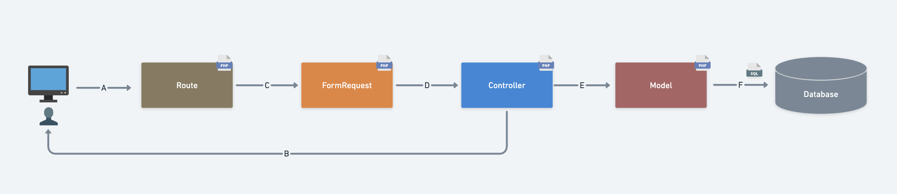
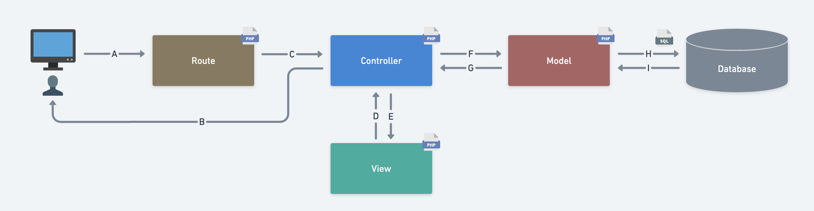

# Laravel Lesson レビュー①

## Routeについて

### `web.php`の目的を説明してください。

### `route()`の引数と戻り値について説明してください。

### ルートネームを定義するメリットについて説明してください。

### ルートパラメータがどんな時に必要なのか説明してください。

## Controllerについて

### コンストラクタメソッドが実行されるのはどのタイミングですか？

### `TodoController`のコンストラクタで何をしているか説明してください。

### `$request->all()`において、どんな情報をどんなデータ型で取得しようとしているか説明してください。

## Modelについて

### `$this->todo->fill($inputs)`が何をしているかModelの`$fillable`を交えて説明してください。

### なぜ$fillableが必要なのか説明してください。

### `$this->todo->save()`が何をしているか説明してください。

### `$this->todo->find($id)`が何をしているか説明してください。

### `$this->todo->all()`の戻り値について説明してください。

### `Collection`クラスとメリットについて説明してください。

## Viewについて

### `view()`の第１・第２引数の役割と、何をするための関数か説明してください。

### `@extends`について説明してください。

### `@yield`・`@section`について説明してください。

### ディレクティブを使用しbladeを分割するメリットを説明してください。

### `{{}}`と`{!! !!}`の違いについて説明してください。

### `@csrf`は何をしているか説明してください。

## FormRequestについて

### `TodoRequest`は何をするためのクラスか説明してください。

### bladeファイルにおいて`$errors`にエラーメッセージが格納されるのはどんな時か説明してください。

### `$errors->any()`をなぜ使うか説明してください。

### `$errors->all()`で何を取得しているか説明してください。

## その他

### マイグレーションファイルでテーブル構成を管理するメリットを説明してください。

### 以下はToDo新規作成の処理の流れを表した図です。A~Fを処理の流れに沿って並べ替え処理を説明してください。

1. A: ユーザが作成ボタンを押下し/todoに入力した内容をPOST
2. 
3. 
4. 
5. 
6. B: 一覧画面にリダイレクト

### 以下はToDo一覧画面の処理の流れを表した図です。A~Iを処理の流れに沿って並べ替え処理を説明してください。

1. A: ユーザがToDo一覧画面(/todo)にアクセス
2. 
3. 
4. 
5. 
6. 
7. 
8. 
9. B: クライアントにレスポンスを返却
